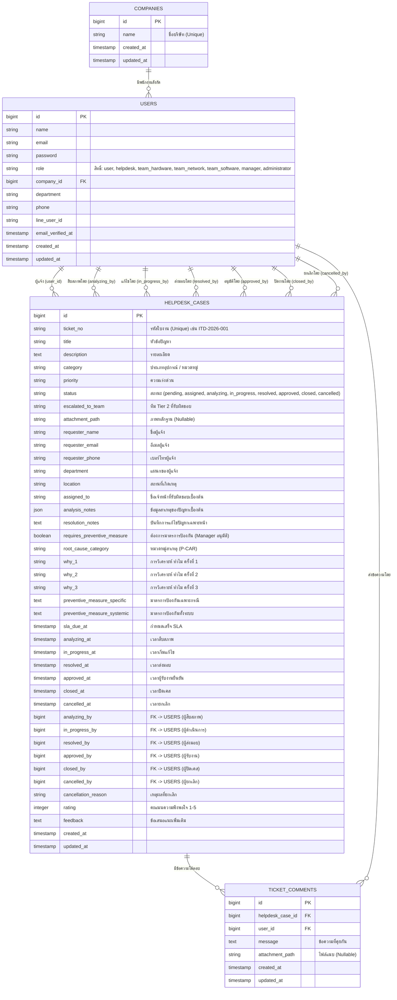

# Entity-Relationship (ER) Diagram

แผนภาพแสดงความสัมพันธ์ของฐานข้อมูลสำหรับระบบ ITDeskService โดยรองรับระบบ Tier 1 (Helpdesk) และ Tier 2 (Hardware, Network, Software) พร้อมรองรับการจัดการข้อมูลบริษัท (Companies) แบบ Dynamic และการแนบไฟล์หลักฐาน

> **หมายเหตุ:** 
> - **การติดตามผู้ปฏิบัติงาน:** ทุกขั้นตอนการเปลี่ยนสถานะ ระบบจะบันทึก ID ของผู้ใช้งานที่กดทำรายการไว้ (analyzing, in_progress, resolved, approved, closed, cancelled)
> - **การจัดการบริษัท (Dynamic Companies):** ดึงข้อมูลรายชื่อบริษัทจากฐานข้อมูล แทนการฝังค่า (Hardcode)
> - **การอนุมัติ (Approval):** Manager (Tier 3) ต้องเข้ามาตรวจสอบงานที่ Resolved แล้ว และเลือกว่าต้องการ Preventive Measure หรือไม่ ก่อนสถานะจะขยับเป็น Approved เพื่อให้ Helpdesk หรือ User ปิดใบงานต่อไป
